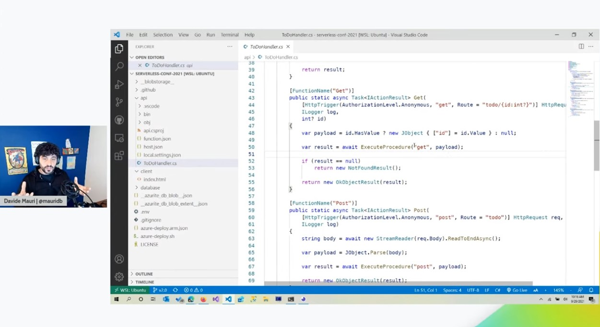

<!--
Guidelines on README format: https://review.docs.microsoft.com/help/onboard/admin/samples/concepts/readme-template?branch=master

Guidance on onboarding samples to docs.microsoft.com/samples: https://review.docs.microsoft.com/help/onboard/admin/samples/process/onboarding?branch=master

Taxonomies for products and languages: https://review.docs.microsoft.com/new-hope/information-architecture/metadata/taxonomies?branch=master
-->

# Serverless Full-Stack Kickstart


Learn how to implement a fully working, end-to-end, full-stack solution using Azure Static Web Apps, Azure Functions and Azure SQL Serverless. In this session we’ll see and build together the simple (but not too simple!) To-Do list reference app, using Vue.js, CI/CD and more!

## Azure Serverless Conference Recording

This demo has been used in the Azure Serverless Conference 2021. Make sure to check out the recording and get the slides here:

- Slides: https://www.slideshare.net/davidemauri/azure-serverless-fullstack-kickstart
- Recording: https://www.youtube.com/watch?v=TIh52zbi8Dk



## Fork the repo

To run this sample in your subscription, make sure to fork the repository into your organization or account. 

## Repo branches

This repo has different branches that shows the development at different stages. This is the branch 6.0.

- 1.0: First version, no database support
- 2.0: Database support added
- 3.0: Authentication and Authorization via EasyAuth
- 4.0: Resilient connections using Polly
- 5.0: Database imperative or declarative CI/CD
- 6:0: [This Branch] Using Vue3 client for the frontend

### V6.0 Notes

In V6.0 the focus is on the front-end, now updated to be a proper [Vue](https://vuejs.org/) project, splitting the UI in in smaller, reusable, components.

### V5.0 Notes

Continuing from V4.0, this branch focuses on including the database in the deployment pipeline and gives you the option to choose between an imperative or a declarative database deployment style.

### V4.0 Notes

Built on top of the V3.0, in this branch retry-logic is added so that if a connection to Azure SQL cannot be made or if a SQL query cannot be executed due to some transient error, the operation is automatically retried for up to 5 times, without returning any error to the end user.

### V3.0 Notes

In this branch the backend REST API service and the database are modified so that a user can be authenticated and they will see and manage only the to-do items they have created. Anonymous access is also allowed, and all to-do items created while not authenticated will be visible and manageable by anyone. Authentication is done via the Azure Static Web Apps reverse proxy, that [takes care of all the complexities](https://docs.microsoft.com/azure/static-web-apps/authentication-authorization) of OAuth2 for you. The Vue web client has been also updated to provide login and logoff capabilities.

### V2.0 Notes

In this branch the backend REST API service is modified so that the to-do list can be saved an managed using an Azure SQL database. Communication with the database is done using JSON too, as Azure SQL support [JSON natively](https://docs.microsoft.com/en-us/sql/relational-databases/json/json-data-sql-server?view=sql-server-ver15). As an alternative, the same API using code [EF Core](https://learn.microsoft.com/en-us/ef/core/) is also provided.
A initial option to (imperatively) deploy the database is also used, either using manually applied database script, or via the EF Core migrations.

### V1.0 Notes

In this branch the solution will have a full working front-end, sending REST request to the fully working backend REST API. The to-do list is saved in-memory using a List object. No authentication or authorization is supported.

## Future Roadmap

- Add API unit testing using [Mocha](https://mochajs.org/)
- Add API smoke tests using [Locust](https://locust.io/)

Future additional branches:

- 7.0: Stop using passwords to allow the backend connect to the database
- 8.0: Use FusionCache to add caching support
- 9.0: Implement [Massive Read-Scale Out pattern](https://github.com/Azure-Samples/azure-sql-db-named-replica-oltp-scaleout)

## Folder Structure

- `/api`: the NodeJs Azure Function code used to provide the backend API, called by the Vue.Js client.
- `/client`: the Vue.Js client. Original source code has been taken from official Vue.js sample and adapted to call a REST client instead of using local storage to save and retrieve todos
- `/database`: the database scripts and the database deployment tools

## Install the dependencies

Make sure you have [Node](https://nodejs.org/en/download/) as it is required by Azure Functions Core Tools and also by Azure Static Web Apps. The backend API will be using .NET Core, but Node is needed to have the local development experience running nicely.

Also install the [Azure Function Core Tools v4](https://www.npmjs.com/package/azure-functions-core-tools):

```sh
npm i -g azure-functions-core-tools@4 --unsafe-perm true
```

Also install the [Azure Static Web Apps CLI](https://github.com/azure/static-web-apps-cli):

```sh
npm i -g @azure/static-web-apps-cli
```

## Create the Azure SQL database

If you don't have a Azure SQL server already, you can create one (no additional costs for a server) running the following [AZ CLI](https://docs.microsoft.com/cli/azure/) command (via [WSL](https://docs.microsoft.com/windows/wsl/), or Linux or [Azure Cloud Shell](https://azure.microsoft.com/features/cloud-shell/)):

```sh
az sql server create -n <server-name> -l <location> --admin-user <admin-user> --admin-password <admin-password> -g <resource-group>
 ```

Create a new Azure SQL database:

```sh
az sql db create -g <resource-group> -s <server-name> -n todo_v5 --service-objective GP_Gen5_2
```

Another option is to run the `azure-create-sql-db.sh` script in the `./databases` folder. The script uses the ARM template available in the same folder to create a server and a `todo_v5` database.

Make sure you have the firewall configured to allow your machine to access Azure SQL:

```sh
az sql server firewall-rule create --resource-group <resource-group> --server <server-name> --name AllowMyClientIP_1 --start-ip-address <your_public_ip> --end-ip-address <your_public_ip>
```

you can get your public IP from here, for example: https://ifconfig.me/

## Deploy the database

There are two may strategies that can be used: imperative and declarative. The imperative approach is the one that has been used until now, where the script to create the database objects are applied in the defined order. The declarative approach is instead where you have the database state (a snapshot of the schema) you want to have and a tool will take care of making all the correct changes to bring the target database to that state.

In both cases the first step is to have at hand the connection string needed to connect to create Azure SQL database. Depending on your deployment strategy preference, switch to the `./database/declarative-deploy` or `./database/imperative-deploy` folder and create new `.env` file, that will contain the aforementioned connection string. Use the provided `.env.template` as a guide. The connection string look like:

```text
Server=<my-server>.database.windows.net;Initial Catalog=todo_v5;User Id=<my_user_id>;Password=<my_user_password>;
```

replace the placeholders with the correct value for your database, username and password and you're good to go. Make sure the database user specified in the connection string has enough permission to create objects (for example, make sure is a server administrator or in the db_owner database role).

Please note that using the server administrator login is not recommended as is way too powerful. If you are testing this on a sample server that you'll not use for production purposes, that shouldn't be an issue. But if want to be on the safe side and implement a correct security process you can create a user that will be used only for running the deployment script:

```sql
create user [deployment_user] with password = '<a_strong_password>';
go

alter role [db_owner] add member [deployment_user]
go
```

### Imperative Deployment

Database is deployed using [DbUp](http://dbup.github.io/). The scripts that will be deployed are in the `./imperative-deploy/sql` folder. Once you have configured the connection string as explained before, you can deploy the database objects:

```sh
cd ./imperative-deploy
dotnet run
```

you will see something like:

```sh
Deploying database: todo_v5
Testing connection...
Starting deployment...
Beginning database upgrade
Checking whether journal table exists..
Journal table does not exist
Executing Database Server script '01-create-objects.sql'
Checking whether journal table exists..
Creating the [dbo].[$__dbup_journal] table
The [dbo].[$__dbup_journal] table has been created
Executing Database Server script '02-update-todo-table.sql'
Executing Database Server script '03-update-stored-procs.sql'
Executing Database Server script '04-move-to-long-user-id.sql'
Executing Database Server script '05-update-stored-procs-support-long-user-id.sql'
Upgrade successful
Success!
```

Database has been deployed successfully!

### Declarative Deployment

Database scripts are stored in the `./database/declarative-deploy/todo_v5` folder, which contains also the related [MSBuild SQL Project](https://techcommunity.microsoft.com/t5/azure-sql-blog/microsoft-build-sql-the-next-frontier-of-sql-projects/ba-p/3290628). 

A SQL Project can be build using the standard `dotnet build` action and it will generate a `.dacpac` file that contains the description of all the database objects that are needed to make your solution work: the database state you need to have deployed. If you want to work on the database project is recommended that you use Visual Studio Code or Azure Data Studio with the "SQL Database Projects" extension.

Deployment will be done via the `sqlpackage` tool. Make sure it is installed and added to your PATH as per the instructions here: [Download and install SqlPackage](https://docs.microsoft.com/en-us/sql/tools/sqlpackage/sqlpackage-download).

Once `sqlpackage` is installed you can deploy the database using the `./database/declarative-deployment/azure-deploy-sql-db.sh` script to automate the whole (build + deploy) process:

```sh
cd ./declarative-deployment
./azure-deploy-sql-db.sh
```

you'll see something like:

```sh
Loading from ../.env
Building .dacpac...
MSBuild version 17.3.0+92e077650 for .NET
  Determining projects to restore...
  All projects are up-to-date for restore.
  Creating a model to represent the project...
  Loading project references...
  Loading project files...
  Building the project model and resolving object interdependencies...
  Validating the project model...
  Writing model to /mnt/w/_git/_owned/azure-sql-db-fullstack-serverless-kickstart/database/declarative-deploy/todo_v5/obj/Debug/Model.xml...
  todo_v5 -> /mnt/w/_git/_owned/azure-sql-db-fullstack-serverless-kickstart/database/declarative-deploy/todo_v5/bin/Debug/todo_v5.dll
  todo_v5 -> /mnt/w/_git/_owned/azure-sql-db-fullstack-serverless-kickstart/database/declarative-deploy/todo_v5/bin/Debug/todo_v5.dacpac

Build succeeded.
    0 Warning(s)
    0 Error(s)

Time Elapsed 00:00:03.17
Publishing .dacpac...
Publishing to database 'todo_v5' on server 'zv6qimpc6cbrg.database.windows.net'.
Initializing deployment (Start)
Initializing deployment (Complete)
Analyzing deployment plan (Start)
Analyzing deployment plan (Complete)
Updating database (Start)
Creating SqlSchema [web]...
Creating SqlTable [dbo].[todos]...
Creating SqlDefaultConstraint unnamed constraint on [dbo].[todos]...
Creating SqlSequence [dbo].[global_sequence]...
Creating SqlDefaultConstraint unnamed constraint on [dbo].[todos]...
Creating SqlProcedure [web].[delete_todo]...
Creating SqlProcedure [web].[get_todo]...
Creating SqlProcedure [web].[patch_todo]...
Creating SqlProcedure [web].[post_todo]...
Update complete.
Updating database (Complete)
Successfully published database.
Time elapsed 0:00:44.97
Done.
```

Database has been deployed successfully!

## Test solution locally

Before starting the solution locally, you have to configure the Azure Function that is used to provide the backed API. In the `./api` folder create a `local.settings.json` file starting from the provided template. All you have to do is update the connection string with the value correct for you solution. If have created the Azure SQL database as described above you'll have a database named `todo_v5`. Just make sure you add the correct server name in the `local.settings.json`. The database name, user login and password are already set in the template file to match those used in this repository and in the `./database/sql/01-create-objects.sql` file.

To run Azure Functions locally, for example to debug them, you also need a local Azure Storage emulator. You can use [Azurite](https://docs.microsoft.com/azure/storage/common/storage-use-azurite?tabs=visual-studio) that also has a VS Code extension.

Make sure Azurite is running and then start the Azure Static Web App emulator:

```sh
swa start   
```

and you'll be good to go.

once this text will appear:

```sh
Azure Static Web Apps emulator started at http://localhost:4280. Press CTRL+C to exit.
```

everything will be up and running. Go the the indicated URL and you'll see the ToDo App. Go an play with it, it will work perfectly, having the Vue.js frontend calling the REST API provided by the Azure Function and storing the to-do list in a List object.

You can also try to login and be an authenticated user. Static Web Apps will provide a mock of the real authentication process (done using the GitHub authentication provider, in this sample), so you can have a full experience also when debugging locally.

## Deploy the solution on Azure

Now that you know everything works fine, you can deploy the solution to Azure. You can take advantage of the script `./azure-deploy.sh` that will deploy the Azure Static Web app for you.

The first time the script will run will create an empty `.env` file in the sample root folder that you have to fill out. Aside from the usual Azure information like the resource group, the location and the app name, you also have to provide a [GitHub Token](https://docs.microsoft.com/azure/static-web-apps/publish-azure-resource-manager?tabs=azure-cli#create-a-github-personal-access-token).

The GitHub Token is needed as Azure Static Web App will create a GitHub action in your repository in order to automate deployment of the solution to Azure. That is right: every time you'll push a code change to your code main code branch, the application will also be re-built and deployed in Azure.

Make sure you set the variable `gitSource` to the address of your forked repository.

If you are using the `.env` file you created in `v1.0`, make sure to add the connection string to Azure SQL by creating and setting the `azureSQL` variable. You can use the same connection string you used in the `./api/local.setting.json` file to test the solution locally.

Run the `./azure-deploy.sh` script and the Azure Static Web app will be deployed in specified resource group. You can run the script using [WSL](https://docs.microsoft.com/windows/wsl/), or Linux or [Azure Cloud Shell](https://azure.microsoft.com/features/cloud-shell/).

### Adding the database to the CI/CD pipeline

Once the deployment script has finished, you can go to the created Azure Static Web App in the Azure Portal and you can see it as been connected to the specified GitHub repository. Azure Static Web App has also created a new workflow in the GitHub repository that uses GitHub Actions to define the CI/CD pipeline that will build and publish the website every time a commit is pushed to the repo.

The generated GitHub Action doesn't know that we are using a database to store to-do list data, so we need to add the database deployment to the GitHub Action manually. No big deal, is a very small change. First of all you have to create a new [GitHub secrets](https://docs.github.com/en/actions/security-guides/encrypted-secrets):

- AZURE_SQL_CONNECTION_STRING

The `AZURE_SQL_CONNECTION_STRING` is the connection string that can be used to deploy the database. You can use the same connection string used for deploying the database objects. You can find it in the `./database/.env` file.

### Imperative Deployment on Azure

Then you have to add the following code, just before the `Build And Deploy` step, to the file you'll find in `./.github/workflow`:

```yaml
- name: Setup .NET Core
  uses: actions/setup-dotnet@v1
  with:
    dotnet-version: '6.0.x' 
- name: Deploy Database
  working-directory: ./database/imperative-deploy
  env: 
    ConnectionString: ${{ secrets.AZURE_SQL_CONNECTION_STRING }}    
  run: dotnet build && dotnet run      
```

The file `./.github/workflow/azure-static-web-apps-imperative-db-deploy.yml.sample` shows an example of how the yaml should look like. Commit and push the changes and the deployment will start again, this time deploying also the database objects.

If you also want to deploy the Azure SQL server and database within the same pipeline, you can do so by using the provided ARM template `./database/azure-sql-db.arm.json` and the [Deploy ARM GitHub Action](https://github.com/Azure/arm-deploy).


### Declarative Deployment on Azure

Then you have to add the following code, just before the `Build And Deploy` step, to the file you'll find in `./.github/workflow`:

```yml
- name: Deploy Database
  uses: azure/sql-action@v1.3
  with:        
    connection-string: ${{ secrets.AZURE_SQL_CONNECTION_STRING }}
    project-file: './database/declarative-deploy/todo_v5/todo_v5.sqlproj'
    build-arguments: '-c Release'
```

The file `./.github/workflow/azure-static-web-apps-declarative-db-deploy.yml.sample` shows an example of how the yaml should look like. Commit and push the changes and the deployment will start again, this time deploying also the database objects.

If you also want to deploy the Azure SQL server and database within the same pipeline, you can do so by using the provided ARM template `./database/azure-sql-db.arm.json` and the [Deploy ARM GitHub Action](https://github.com/Azure/arm-deploy).

## Run the solution on Azure

Once deployment is done, you'll have the Azure Static Web App ready. An example of the Azure Static Web App url you'll get is something like:

https://gentle-bush-039d94710.azurestaticapps.net

The first time you'll visit the URL you might not see any to-do item, even if a couple are already inserted in the created sample database. This is due the fact that the Azure Function running behind the scenes can take several seconds to start up the first time. Give it a couple of retry and they you'll be able to see two to-do items.

Congratulations you have a fully working full-stack solution!

## Done

The solution is now complete, providing everything needed to serve users!
